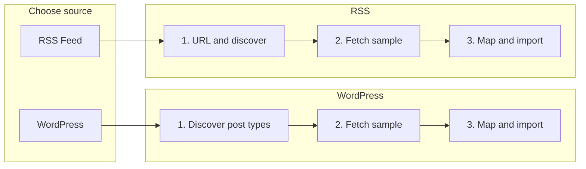

# RSS feed import (updated)

## Current flow (WordPress)

- **Choose source** → WordPress card.
- **Stage 1:** Connect and discover → `discoverWordPress`: site URL + optional auth → returns post types.
- **Stage 2:** Discover structure → `fetchWordPress`: pick post type → fetch one item → returns `sample` for mapping.
- **Stage 3:** Map, filter, destination, import → `importFromWordPress`: field paths, filters, range, webhook, schedule, skip duplicates.

RSS will mirror this with **three stages**: (1) Pick URL and discover, (2) Fetch sample to see structure, (3) Map, filter, destination, import.

## Architecture

## 1. Dependency

- Add **rss-parser** (e.g. `npm install rss-parser`) for server-side RSS/Atom parsing.

## 2. Server: new actions in [src/routes/bulk-create/+page.server.ts](src/routes/bulk-create/+page.server.ts)

- **discoverRss**
  - Input: `feed_url` (required).
  - Fetch URL, parse with rss-parser.
  - Return: `{ rss_discovered: true, feed_url, feed_title?, item_count }` (no sample yet).
  - On failure: return `fail(400, { error: '...' })`.

- **fetchRssSample**
  - Input: `feed_url` (required).
  - Re-fetch and parse feed; take the first item; normalize to a plain object (title, link, content, contentSnippet, guid, pubDate, isoDate, etc.).
  - Return: `{ rss_fetched: true, feed_url, rss_sample }` so the client can show the sample in the reference panel and drive datalists for mapping.
  - On failure: return `fail(400, { error: '...' })`.

- **importFromRss**
  - Same as before: feed_url, mapping, filter_rules, range, webhook, schedule, import_status, skip_duplicates. Re-fetch feed, slice items, apply filter/mapping, insert posts with `import_source_id` = `rss:${normalizedUrl}:${guid||link||index}`.

## 3. Client: [src/routes/bulk-create/+page.svelte](src/routes/bulk-create/+page.svelte)

- **RSS Stage 1 – Pick URL and discover**
  - Form POST `?/discoverRss`: Feed URL only.
  - On success: show `feed_title`, `item_count`, and **Stage 2**.

- **RSS Stage 2 – Fetch sample**
  - When `rss_discovered` and no sample yet: form POST `?/fetchRssSample` with hidden `feed_url`.
  - Button: "Fetch sample" / "Retrieve first item" (and optional "Refresh sample" after).
  - On success: form returns `rss_fetched: true`, `rss_sample`. Show the sample in a reference block (same as WordPress: example item JSON) and **Stage 3**.

- **RSS Stage 3 – Map, filter, destination, import**
  - When `rss_fetched && rss_sample`: show full map/filter/destination form (action `?/importFromRss`).
  - Use `form.rss_sample` for `keys`, `samplePreviewJson`, datalists, and the reference panel so the user sees the structure and mapping is easier.

- **Unified sample for RSS**
  - Derived state when `selectedSource === 'rss'`: `sample` = `form.rss_sample`, `fetched` = `form.rss_fetched`, so the same Step 3 layout (field mapping, import range, filters, destination, reference sidebar) works with RSS sample and paths (title, content, link, isoDate, etc.).

## 4. RSS item shape

- rss-parser items: `title`, `link`, `content`, `contentSnippet`, `guid`, `pubDate`, `isoDate`, `creator`, etc. Pass first item as `rss_sample`; reference panel and datalists show these paths.

## 5. Files to touch

| File | Changes |
|------|--------|
| package.json | Add `rss-parser`. |
| src/routes/bulk-create/+page.server.ts | Add `discoverRss` (no sample), `fetchRssSample` (return sample), `importFromRss`; reuse filter/mapping/insert/schedule logic. |
| src/routes/bulk-create/+page.svelte | RSS source card; RSS Stage 1 (URL + discover); RSS Stage 2 (Fetch sample); RSS Stage 3 (map/filter/destination/import) with reference panel driven by `rss_sample`. |

No new routes or DB migrations. RSS uses the same `post.import_source_id` and webhook/schedule/post structure as WordPress.
